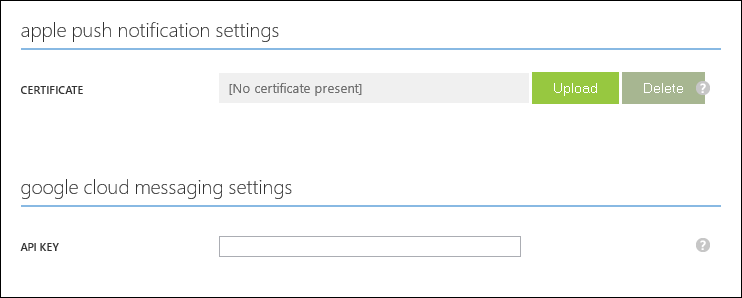

# Use Microsoft Azure to push notifications to Cordova apps

This sample shows how to use Microsoft Azure with the Visual Studio Tools for Apache Cordova to enable push notifications to your Cordova apps running on iOS or Android devices. The sample supports the MSDN Magazine Article [Use Microsoft Azure to Push Notifications to Cordova Apps]. The  Mobile Services client is used to register for template-based push notifications with Azure Notification Hubs, which is then used to send push notifications from a platform notification service (PNS) to your Cordova app running on iOS or Android. 

>**Note:** The [article][Use Microsoft Azure to Push Notifications to Cordova Apps] was originally written based on the Apache Cordova Tools for Visual Studio 2013. However, this sample project has been revised to use Cordova tools in Visual Studio 2015, which are not compatible with the previous version.

This sample is based on the [BackboneJS sample for Apache Cordova](http://aka.ms/sffl1f). However, regardless of the JavaScript framework you use for your app (if any), the same basic concepts apply. These steps differ somewhat from the steps in the MSDN Magazine article (which does only cover Android). The steps in the article use Visual Studio to configure Mobile Services, whereas the steps in this readme use the Azure Management portal to configure your Azure services.

## Prerequisites 
To run this Apache Cordova for Visual Studio sample app on one or more of the supported client platforms, you must have the following:

+ An Active Microsoft Azure subscription. You can sign-up for a trial account [here](http://www.windowsazure.com/en-us/pricing/free-trial/).
+ Visual Studio 2015 Community, which includes the [Visual Studio Tools for Apache Cordova](https://www.visualstudio.com/cordova-vs). 
+ For a given client platform, you must also meet these platform-specific requirements:

	**iOS:**
	+ A physical iOS device, iPhone or iPad.
	+ [Xcode](https://go.microsoft.com/fwLink/p/?LinkID=266532) v6.0 or a later version running on a MacOSX environment (required by the Visual Studio Tools for Apache Cordova).
	+ [iOS Developer Program](https://developer.apple.com/programs/ios/develop.html) registration (required to configure push notifications).

	**Android**
	+ (Optional) A physical Android device. If you don't have an Android device, the next best thing is the [Visual Studio emulator for Android](https://www.visualstudio.com/explore/msft-android-emulator-vs).
	+ [Android Developer Tools](). Android 4.4.2 (API 19) only has been tested (installed by the Visual Studio Tools for Apache Cordova).
	+ Google Play Services version 27 or greater, Google Repository version 22 or greater, and Google APIs must also be installed, if these are not already included in your Android SDK. 
	+ Google account that has a verified email address. To create a new Google account, go to <a href="http://go.microsoft.com/fwlink/p/?linkid=268302&clcid=0x409" target="_blank">accounts.google.com</a>.

##Configure platform-specific push notifications 

1. Complete the steps to register your app to authenticate for push notifications with each platform-specific push service:

	+ **iOS:** Apple Push Notification Services (APNS)
	
		Complete the bulleted steps at the beginning of the topic [Add Push Notifications to iOS App](https://azure.microsoft.com/en-us/documentation/articles/mobile-services-javascript-backend-ios-get-started-push/). Also, complete the first step in [Configure Azure to Send Push Notifications](https://azure.microsoft.com/en-us/documentation/articles/mobile-services-javascript-backend-ios-get-started-push/#configure).

	+ **Android:** Google Cloud Messaging (GCM)

		Complete the topic [How to enable Google Cloud Messaging](http://azure.microsoft.com/en-us/documentation/articles/mobile-services-how-to-enable-google-cloud-messaging/). 
		
		To add Google Play Services to your Android app, you will also need to follow the steps in the **Add Google Play Services to the project** section of [Get started with Notification Hubs](http://azure.microsoft.com/en-us/documentation/articles/notification-hubs-android-get-started/).
		
2. Log on to the [Azure Management Portal](https://manage.windowsazure.com/), click **Mobile Services**. 

	If you already created your mobile service and TodoItem table, skip down to step 5.

3. (Optional) If you haven't already created a Mobile Service, you can follow the steps at [How to create a new mobile service](https://azure.microsoft.com/en-us/documentation/articles/mobile-services-javascript-backend-phonegap-get-started/#create-a-new-mobile-service). 

4. (Optional) If you don't already have a TodoItem table, click the **Data** tab, click the **Create** button, supply a **Table Name** of `TodoItem`, then click the check button.
 
5. Select your mobile service, click the **Push** tab, then supply the authentication credentials for the supported push notification platforms:

	+ **APNS**
		
		Upload the .p12 certificate obtained in step 1. 

	+ **GCM**
			
		Set the API key value obtained in step 1. 

	 
 
	At this point, Notification Hubs can send push notifications on behalf of your app.

6. Click the **Data** tab, click the **TodoItem** table, click **Script** and replace the existing insert script with the following code, which you can also find in the \service\table\todoitem.insert.js file:

		function insert(item, user, request) {
		    // Execute the request and send notifications.
		    request.execute({
		        success: function () {
		            // Create a template-based payload.
		            var payload = '{ "message" : "New item added: ' + item.text + '" }';
		
		            // Write the default response and send a template notification
		            // to all registered devices on all platforms.            
		            push.send(null, payload, {
		                success: function (pushResponse) {
		                    console.log("Sent push:", pushResponse);
		                    // Send the default response.
		                    request.respond();
		                },
		                error: function (pushResponse) {
		                    console.log("Error Sending push:", pushResponse);
		                    // Send the an error response.
		                    request.respond(500, { error: pushResponse });
		                }
		            });
		        }
		    });
		}

	This sends a push notification to all registered devices when a new item is inserted. 
		
 
##Update the Cordova project for your Azure services

Now that you have push notifications configured, you need to update the sample app to point to your mobile service and notification hub.

1. In the management portal, click the **Dashboard** tab and make a note of the value of your **Mobile Service URL**.

2. Click **Manage Keys** and make a note of the **Application Key** for your mobile service. 

3. In the Solution Explorer in Visual Studio, navigate to the `\services\mobileservices\settings` project subfolder and open the services.js file.

5. Replace the values of the `MOBILE_SERVICE_URL` and `MOBILE_SERVICE_APP_KEY` variables with the values you just obtained for your mobile service.

6. For Android, replace the value of the `GCM_SENDER_ID` variable with the project number value assigned when you registered your app in the Google Developers Console.

##Build and test the app

1. Make sure that Visual Studio debugging is configured for the desired platforms.

2. Follow the instructions to run your app on one of the supported platforms:
 
	+ [iOS project](http://taco.visualstudio.com/en-us/docs/run-app-ios/#iOSDevice)  
	 Remember that iOS requires a physical device.

	+ [Android project](http://taco.visualstudio.com/en-us/docs/run-app-apache/)
	
    The Apache Ripple emulator does not support push notifications.
			
	After launching the app in one of the mobile emulators above, you will see a registration success alert. 

6. Type some text into the textbox and then click **Add**.

	This sends a POST request to the new mobile service hosted in Azure. Data from the request is inserted into the **TodoItem** table and a push notification is generated and sent to all registered devices. 

[Use Microsoft Azure to Push Notifications to Cordova Apps]: http://aka.ms/yh3uh5
