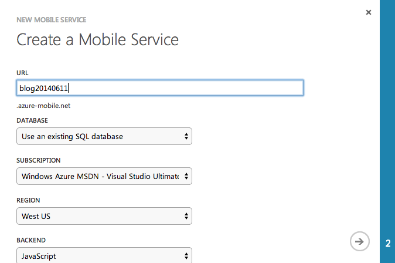
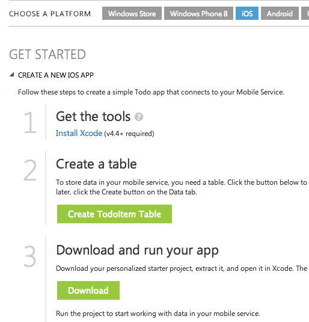
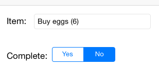
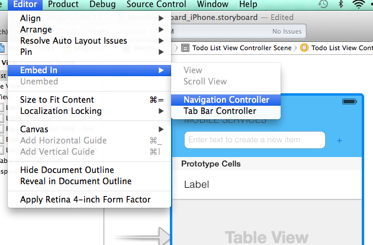
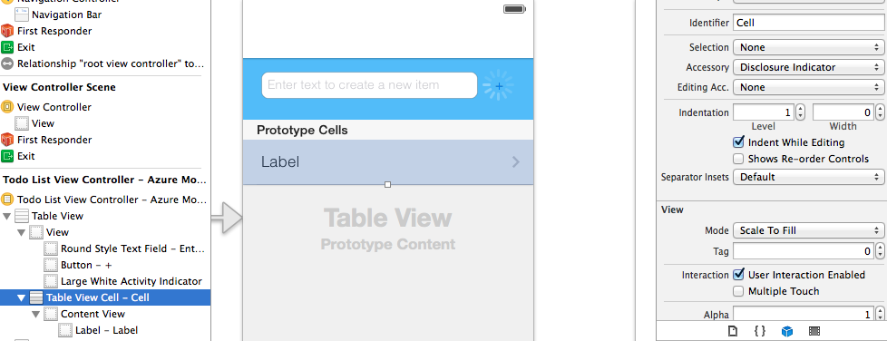
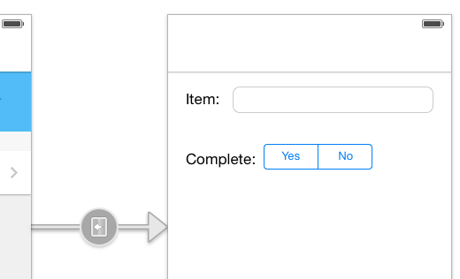

#Offline support in the Azure Mobile Services iOS SDK

We’ve just released a preview version of the Azure Mobile Services SDK for iOS with offline support. Like the offline support in the .NET SDK, we're releasing a preview version of the offline so that we can get feedback (from you!) to make sure that we release this feature in a way that will suit your applications.

To present the new feature in the SDK, we'll walk through the steps to make our sample Todo app offline-enabled. We'll be talking about the features as they are needed for the app.

## Initial setup

To start off the walkthough, let's use the quickstart application that you can download in the portal. Create a new mobile service. For this example, let's use the node.js backend which we can setup without needing to use Visual Studio.

Once the service is created, choose the iOS platform, then select "Create TodoItem Table" and then download the starter project to your Mac.

Open it in Xcode and we're ready to start.

## Updating the quickstart app

The offline support we're previewing here has some nice features. One of them is the ability to resolve conflicts which can happen when pushing the local changes to the table in Azure. For example, if you're running the same app in two phones, and changed *the same* item in both phones locally, when you're ready to push the changes back to the server one of them will fail with a conflict. The SDK allows you to deal with those conflicts via code, and decide what to do with the item which has a conflict.

The current quickstart, however, doesn't really have many occasions where conflicts can arise, since the only action we can take for an item is to mark it as complete. True, we can mark the item as complete in one client and then do the same in another client, but although technically this is a conflict (and the framework will flag it as such) it's not too interesting. Let's then change the quickstart to make it more interesting by allowing full editing of the todo items.

In the code you can download you'll see that I've updated the app to allow for editing the items. If you want to follow the same steps I did for that, you can go to the appendix at the end of this post.

## Updating the framework

The first thing we'll need to do to add offline support in our application is to get a version of the Mobile Services iOS SDK which supports it. Since we're launching it as a preview feature, it won't be in the official download location. For now you can go to http://aka.ms/Gc6fex and download it locally.

Then, remove the existing framework from the project in Xcode, selecting "Move to Trash" to really delete the files.

And add in its place the new one which you get after unzipping the file downloaded above (make sure the "Copy items into destination group's folder (if needed)" is selected).

## Setting up Core Data

Like in the managed SDK, the offline support in the iOS Mobile Services SDK is implemented in a store-agnostic way - meaning you could use whatever persistent store you want as long as it complies with the `MSSyncContextDataSource` protocol. That is a fairly low level protocol, and we don't expect many people to implement their own data sources, so we're including in this preview one data source which is based on the [Core Data framework](https://developer.apple.com/library/ios/documentation/Cocoa/Conceptual/CoreData/cdProgrammingGuide.html).

Since we're using this data store, let's prepare the application to work with Core Data. First, open the application target, and in its "Build phases", under the "Link Binary With Libraries", add the CoreData.framework

Next, let's add the Core Data boilerplate code. Open the QSAppDelegate header file and add the following declarations:

    #import <UIKit/UIKit.h>
    #import <CoreData/CoreData.h>

    @interface QSAppDelegate : UIResponder <UIApplicationDelegate>

    @property (strong, nonatomic) UIWindow *window;

    @property (readonly, strong, nonatomic) NSManagedObjectContext *managedObjectContext;
    @property (readonly, strong, nonatomic) NSManagedObjectModel *managedObjectModel;
    @property (readonly, strong, nonatomic) NSPersistentStoreCoordinator *persistentStoreCoordinator;

    - (void)saveContext;
    - (NSURL *)applicationDocumentsDirectory;

    @end

Now open the implementation file (QSAppDelegate.m) and add the implementation for the core data stack methods. Notice that this is pretty much the code that you get when you create a new application in Xcode and select the "Use Core Data" checkbox, with the main difference that we're using a private queue concurrency type when initializing the `NSManagedContextObject`.

    @implementation QSAppDelegate

    @synthesize managedObjectContext = _managedObjectContext;
    @synthesize managedObjectModel = _managedObjectModel;
    @synthesize persistentStoreCoordinator = _persistentStoreCoordinator;

    - (BOOL)application:(UIApplication *)application didFinishLaunchingWithOptions:(NSDictionary *)launchOptions
    {
        return YES;
    }

    - (void)saveContext
    {
        NSError *error = nil;
        NSManagedObjectContext *managedObjectContext = self.managedObjectContext;
        if (managedObjectContext != nil) {
            if ([managedObjectContext hasChanges] && ![managedObjectContext save:&error]) {
                // Replace this implementation with code to handle the error appropriately.
                // abort() causes the application to generate a crash log and terminate. You should not use this function in a shipping application, although it may be useful during development.
                NSLog(@"Unresolved error %@, %@", error, [error userInfo]);
                abort();
            }
        }
    }

    #pragma mark - Core Data stack

    // Returns the managed object context for the application.
    // If the context doesn't already exist, it is created and bound to the persistent store coordinator for the application.
    - (NSManagedObjectContext *)managedObjectContext
    {
        if (_managedObjectContext != nil) {
            return _managedObjectContext;
        }

        NSPersistentStoreCoordinator *coordinator = [self persistentStoreCoordinator];
        if (coordinator != nil) {
            _managedObjectContext = [[NSManagedObjectContext alloc] initWithConcurrencyType:NSPrivateQueueConcurrencyType];
            [_managedObjectContext setPersistentStoreCoordinator:coordinator];
        }
        return _managedObjectContext;
    }

    // Returns the managed object model for the application.
    // If the model doesn't already exist, it is created from the application's model.
    - (NSManagedObjectModel *)managedObjectModel
    {
        if (_managedObjectModel != nil) {
            return _managedObjectModel;
        }
        NSURL *modelURL = [[NSBundle mainBundle] URLForResource:@"QSTodoDataModel" withExtension:@"momd"];
        _managedObjectModel = [[NSManagedObjectModel alloc] initWithContentsOfURL:modelURL];
        return _managedObjectModel;
    }

    // Returns the persistent store coordinator for the application.
    // If the coordinator doesn't already exist, it is created and the application's store added to it.
    - (NSPersistentStoreCoordinator *)persistentStoreCoordinator
    {
        if (_persistentStoreCoordinator != nil) {
            return _persistentStoreCoordinator;
        }

        NSURL *storeURL = [[self applicationDocumentsDirectory] URLByAppendingPathComponent:@"qstodoitem.sqlite"];

        NSError *error = nil;
        _persistentStoreCoordinator = [[NSPersistentStoreCoordinator alloc] initWithManagedObjectModel:[self managedObjectModel]];
        if (![_persistentStoreCoordinator addPersistentStoreWithType:NSSQLiteStoreType configuration:nil URL:storeURL options:nil error:&error]) {
            /*
             Replace this implementation with code to handle the error appropriately.

             abort() causes the application to generate a crash log and terminate. You should not use this function in a shipping application, although it may be useful during development.

             Typical reasons for an error here include:
             * The persistent store is not accessible;
             * The schema for the persistent store is incompatible with current managed object model.
             Check the error message to determine what the actual problem was.

             If the persistent store is not accessible, there is typically something wrong with the file path. Often, a file URL is pointing into the application's resources directory instead of a writeable directory.

             If you encounter schema incompatibility errors during development, you can reduce their frequency by:
             * Simply deleting the existing store:
             [[NSFileManager defaultManager] removeItemAtURL:storeURL error:nil]

             * Performing automatic lightweight migration by passing the following dictionary as the options parameter:
             @{NSMigratePersistentStoresAutomaticallyOption:@YES, NSInferMappingModelAutomaticallyOption:@YES}

             Lightweight migration will only work for a limited set of schema changes; consult "Core Data Model Versioning and Data Migration Programming Guide" for details.

             */

            NSLog(@"Unresolved error %@, %@", error, [error userInfo]);
            abort();
        }

        return _persistentStoreCoordinator;
    }

    #pragma mark - Application's Documents directory

    // Returns the URL to the application's Documents directory.
    - (NSURL *)applicationDocumentsDirectory
    {
        return [[[NSFileManager defaultManager] URLsForDirectory:NSDocumentDirectory inDomains:NSUserDomainMask] lastObject];
    }

    @end

At this point the application is (almost) ready to use Core Data, but it's not doing anything with it.

## Defining the model

The last thing we need to do to use the Core Data framework is to define the data model which will be stored in the persistent store. If you're not familiar with Core Data you can think of it as a simplified "schema" of the local database. We need to define the tables used by the application, but we also need to define a couple of tables which will be used by the Mobile Services framework itself (both to track the items which need to be synchronized with the server, and any errors which may happen during this synchronization).

In the project, select "New File", and under the Core Data section, select Data Model.

Select an appropriate name (I'll use QSTodoDataModel.xcdatamodeld) and click Create. Select the data model in the folder view, then add the entities required for the application, by selecting the "Add Entity" button in the bottom of the page.

Add three entities, named "TodoItem", "MS_TableOperations" and "MS_TableOperationErrors" (the first to store the items themselves; the last two are framework-specific tables required for the offline feature to work) with attributes defined as below:

**TodoItem**

| Attribute  |  Type   |
|----------- |  ------ |
| id         | String  |
| complete   | Boolean |
| text       | String  |
| ms_version | String  |

**MS_TableOperations**

| Attribute  |    Type     |
|----------- |   ------    |
| id         | Integer 64  |
| properties | Binary Data |
| itemId     | String      |
| table      | String      |

**MS_TableOperationErrors**

| Attribute  |    Type     |
|----------- |   ------    |
| id         | String      |
| properties | Binary Data |

Save the model, and build the project to make sure that everything is fine. As before, we're just setting up the application to work with Core Data, but we haven't started using it yet.

## From table to sync table

And let's start caching some data offline! There are a few things we'll need to change. First, instead of using the regular `MSTable` class to access the mobile service, we'll use a different class now: `MSSyncTable`. A sync table is basically a local table which "knows" how to push changes made locally to the "remote" table, and pull items from that table locally. We'll also need to initialize the *synchronization context* in the `MSClient` (a new property) with the data source that we choose (in our case, the Core Data-based store implementation as I mentioned before). Let's start. In the implementation for the QSTodoService class, remove the private property `table`, and add the following property for the sync table:

    @property (nonatomic, strong) MSSyncTable *syncTable;

Now, in the initializer for the QSTodoService class, remove the line that creates the MSTable object and replace it with the following lines (you'll also need to `#include "QSAppDelegate.h"`):

    QSAppDelegate *delegate = (QSAppDelegate *)[[UIApplication sharedApplication] delegate];
    NSManagedObjectContext *context = delegate.managedObjectContext;
    MSCoreDataStore *store = [[MSCoreDataStore alloc] initWithManagedObjectContext:context];

    self.client.syncContext = [[MSSyncContext alloc] initWithDelegate:nil dataSource:store callback:nil];

    // Create an MSSyncTable instance to allow us to work with the TodoItem table
    self.syncTable = [self.client syncTableWithName:@"TodoItem"];

Before we can start using the offline feature, we need to initialize the sync context of the client. The context is responsible for tracking which items have been changed locally, and sending those to the server when a push operation is started. To initialize the context we need a data source (for which we can use the `MSCoreDataStore` implementation of the protocol), and an optional `MSSyncContextDelegate` implementation. For now we can pass `nil`, but we'll get back to it when talking about conflicts.

We now need to update the operations in the `QSTodoService` class to use the sync table instead of the (regular / remote) table. First, the `refreshDataOnSuccess`, which retrieves the data from the service. This time, we'll first ask the sync table to pull any items which match our criteria, then we'll load the data from the *local* (sync) table into the `items` property of the service.

    - (void)refreshDataOnSuccess:(QSCompletionBlock)completion
    {
        // Create a predicate that finds items where complete is false
        NSPredicate * predicate = [NSPredicate predicateWithFormat:@"complete == NO"];

        MSQuery *query = [self.syncTable queryWithPredicate:predicate];

        // Pulls data from the remote server into the local table. We're only
        // pulling the items which we want to display (complete == NO).
        [self.syncTable pullWithQuery:query completion:^(NSError *error) {
            [self logErrorIfNotNil:error];

            [self loadLocalDataWithCompletion:completion];
        }];
    }

    - (void) loadLocalDataWithCompletion:(QSCompletionBlock)completion
    {
        NSPredicate * predicate = [NSPredicate predicateWithFormat:@"complete == NO"];
        MSQuery *query = [self.syncTable queryWithPredicate:predicate];

        [query orderByAscending:@"text"];
        [query readWithCompletion:^(NSArray *results, NSInteger totalCount, NSError *error) {
            [self logErrorIfNotNil:error];

            items = [results mutableCopy];

            // Let the caller know that we finished
            dispatch_async(dispatch_get_main_queue(), ^{
                completion();
            });
        }];
    }

For inserts, we only insert into the sync table. That operation will then be *queued* so that until we push the changes to the remote service, it will only be visible to the client where it was performed.

    -(void)addItem:(NSDictionary *)item completion:(QSCompletionWithIndexBlock)completion
    {
        // Insert the item into the TodoItem table and add to the items array on completion
        [self.syncTable insert:item completion:^(NSDictionary *result, NSError *error)
         {
             [self logErrorIfNotNil:error];

             NSUInteger index = [items count];
             [(NSMutableArray *)items insertObject:result atIndex:index];

             // Let the caller know that we finished
             dispatch_async(dispatch_get_main_queue(), ^{
                 completion(index);
             });
         }];
    }

A similar change for the update operation. One minor difference is that for `MSTable` update operations, the completion block returns the updated item, since a script (or controller action) in the server can modify the item being updated, and we want that modification to be reflected on the client. For local tables, the updated items are not modified, so the completion block doesn't have a parameter for that updated item. 

    - (void)updateItem:(NSDictionary *)item atIndex:(NSInteger)index completion:(QSCompletionWithIndexBlock)completion {
        // Cast the public items property to the mutable type (it was created as mutable)
        NSMutableArray *mutableItems = (NSMutableArray *) items;

        // Replace the original in the items array
        [mutableItems replaceObjectAtIndex:index withObject:item];

        // Update the item in the TodoItem table and remove from the items array on completion
        [self.syncTable update:item completion:^(NSError *error) {
            [self logErrorIfNotNil:error];

            NSInteger index = -1;
            if (!error) {
                BOOL isComplete = [[item objectForKey:@"complete"] boolValue];
                NSString *remoteId = [item objectForKey:@"id"];
                index = [items indexOfObjectPassingTest:^BOOL(id obj, NSUInteger idx, BOOL *stop) {
                    return [remoteId isEqualToString:[obj objectForKey:@"id"]];
                }];

                if (index != NSNotFound && isComplete)
                {
                    [mutableItems removeObjectAtIndex:index];
                }
            }

            // Let the caller know that we have finished
            dispatch_async(dispatch_get_main_queue(), ^{
                completion(index);
            });
        }];
    }

We can now really test the application offline. Add a few items in the app. Then go to the portal and browse the data (or use a networking tool such as PostMan or Fiddler to query the table directly). You'll see that the items have not been added to the service yet. Now perform the refresh gesture in the app by dragging it from the top. You'll see that the data has been saved in the cloud now. You can even close the app after adding (or editing) some items. When you launch the app again it will synchronize with the server (more on that later) and your changes will have been saved.

## Pulling and pushing

There are basically two ways of synchronizing the data between the local store and the remote service. When we want to bring data from the service into the local tables, we need to perform a *pull* operation. This is executed in the sync table, so that you can pull data on a per-table basis. For example, if you have an application which displays orders and each order can have many items, you only need to load the orders locally, and only when an order is selected you need to pull data from the items table (assuming that the information is stored in those two tables). In the code shown in the previous section, the operation `refreshDataOnSuccess:` is pulling the data from the remote table into the local (sync) table. Notice that we can (and often should) pull only a subset of the table so that we don't overload the client with information that it may not need.

When the client performs some changes (inserts / deletes / updates) in the items locally, those changes are stored in the sync context to be sent to the server. A *push* operation sends the tracked changes to the remote server. You would call push in the sync context via the `pushWithCompletion:` method.

You may have noticed that in the code I showed above there are no calls to the push method. But the data is still being sent to the server, as you could see when performing the refresh gesture. What is happening is that **before a pull is executed, any pending operations are pushed to the server**. That is done to prevent conflicts - if an item is modified locally and in the service, we want to make sure that the service (the "source of truth") has the ability to reject the changes (thus the push) by returning a conflict response to the push request. An implicit push is also executed when we *purge* the local tables (via the `MSSyncTable`'s `purgeWithQuery:` method, which we don't use in this sample).

## Threading considerations

Another thing which you may have also noticed is that after we changed the code to use the sync table, I wrapped the calls to the completion blocks in the `QSTodoService` methods in a dispatch call to the main thread:

    dispatch_async(dispatch_get_main_queue(), ^{
        completion();
    });

Since when we initialized the sync context, we did not pass a callback parameter, the framework creates a default serial queue for you which dispatches the results of all sync table operations into into a background thread. This is advantageous for performance reasons as data operations are executed in the background, but when using the results to modify UI components we need to dispatch the code back to the UI thread.

## Conflict handling

Well, offline handling of data is great, but what happens if there is a conflict when a push operation is being executed? To test this scenario you'll need a HTTP tool such as Fiddler or Postman to simulate changes from other devices (or two devices, or a device and the simulator - basically two different clients which can modify data).

Let's load the data in the app. In my list I have an item to "Buy eggs", but I'll edit it to "Buy eggs (6)":

On another client, I'll send a PATCH request for that same item to update it (the id, ETag, mobile service name and app key will be different for your service):

    PATCH https://blog20140611.azure-mobile.net/tables/todoitem/D265929E-B17B-42D1-8FAB-D0ADF26486FA?__systemproperties=__version
    Content-Type: application/json
    x-zumo-application: UiMJHSlktoYGRxGtgkLfgGoZFjqcGS10
    If-Match: "AAAAAAAAjkY="

    {
        "id": "D265929E-B17B-42D1-8FAB-D0ADF26486FA",
        "text": "Buy organic eggs"
    }

Now try to refresh the items on the app. On the completion block in the call to `pullWithQuery:completion:`, the error parameter will be non-nil, which will cause the error to be printed out to the output via `NSLog` (line breaks added for clarity):

    2014-06-09 23:40:04.297 blog20140611[8212:1303]
        ERROR Error Domain=com.Microsoft.WindowsAzureMobileServices.ErrorDomain
        Code=-1170 "Not all operations completed successfully" UserInfo=0x8f3a200
        {com.Microsoft.WindowsAzureMobileServices.ErrorPushResultKey=(
            "The server's version did not match the passed version"
        ), NSLocalizedDescription=Not all operations completed successfully}

So we have a local change which cannot be pushed, since it's conflicting with what's in the server. To solve this issue we need to add a conflict handler. We could do that in the server (as is shown in [this tutorial](http://azure.microsoft.com/en-us/documentation/articles/mobile-services-windows-store-dotnet-handle-database-conflicts/)), but here we'll let the user decide how to handle the conflict by dealing with it in the client, and for that we'll need to implement the `MSSyncContextDelegate` protocol.

Let's start by changing our QSTodoService factory method to receive that delegate as a parameter. Remove the existing `defaultService` method and replace it with the declaration below:

    + (QSTodoService *)defaultServiceWithDelegate:(id<MSSyncContextDelegate>)delegate;

In the implementation file, in addition to the change in the factory method, also modify the private constructor `init` to take the delegate as a parameter:

    -(QSTodoService *)initWithDelegate:(id<MSSyncContextDelegate>)syncDelegate

Now change the call to the initializer to pass the delegate, and change the initialization of the sync context to pass the delegate:

    self.client.syncContext = [[MSSyncContext alloc] initWithDelegate:syncDelegate dataSource:store callback:nil];

On to the todo list view controller. Change the interface declaration to implement the `MSSyncContextDelegate` protocol:

    @interface QSTodoListViewController : UITableViewController <MSSyncContextDelegate>

and pass the `self` pointer to the delegate when initializing the `todoService` property:

    // Create the todoService - this creates the Mobile Service client inside the wrapped service
    self.todoService = [QSTodoService defaultServiceWithDelegate:self];

Now we can implement the `tableOperation:onComplete:` operation, which will be called for every item which is being sent (pushed) to the service. Our goal here is to let the user choose which version they want to keep: the client (which will then override the version in the server), the server (whose value will remain unchanged, and will be updated in the client local table) or cancel the whole push operation (and leave the operation pending). And since while we're displaying the choices to the user another update may have happened in the same item on the server, we'll keep showing the options until the server stops returning a precondition failed response.

    - (void)tableOperation:(MSTableOperation *)operation onComplete:(MSSyncItemBlock)completion
    {
        [self doOperation:operation complete:completion];
    }

    - (void)doOperation:(MSTableOperation *)operation complete:(MSSyncItemBlock)completion
    {
        [operation executeWithCompletion:^(NSDictionary *item, NSError *error) {
            if (error.code == MSErrorPreconditionFailed) {
                QSUIAlertViewWithBlock *alert = [[QSUIAlertViewWithBlock alloc] initWithCallback:^(NSInteger buttonIndex) {
                    if (buttonIndex == 1) { // Client
                        NSDictionary *serverItem = [error.userInfo objectForKey:MSErrorServerItemKey];
                        NSMutableDictionary *adjustedItem = [operation.item mutableCopy];
                    
                        [adjustedItem setValue:[serverItem objectForKey:MSSystemColumnVersion] forKey:MSSystemColumnVersion];
                        operation.item = adjustedItem;

                        [self doOperation:operation complete:completion];
                        return;

                    } else if (buttonIndex == 2) { // Server
                        NSDictionary *serverItem = [error.userInfo objectForKey:MSErrorServerItemKey];
                        completion(serverItem, nil);
                    } else { // Cancel
                        [operation cancelPush];
                        completion(nil, error);
                    }
                }];

                [alert showAlertWithTitle:@"Server Conflict"
                                  message:@"How do you want to resolve the conflict?"
                        cancelButtonTitle:@"Cancel"
                        otherButtonTitles:[NSArray arrayWithObjects:@"Use Client", @"Use Server", nil]];
            } else {
                completion(item, error);
            }
        }];
    }

In this code we're using a helper class which shows an alert view and takes a delegate that is invoked when the alert view is displayed. The complete code can be seen in the repository shown below.

## Wrapping up

We're now adding offline support for native iOS applications, and just like we did in the managed SDK, we're making an early release available. We really appreciate your feedback so we can continue improving in the SDKs for Azure Mobile Services. As usual, please leave comments / suggestions / questions in this post, or in or [MSDN Forum](http://social.msdn.microsoft.com/Forums/windowsazure/en-US/home?forum=azuremobile).

If you want to download the code used in this post, you can get it in the mobile services samples repository in GitHub, under https://github.com/Azure/mobile-services-samples/tree/master/TodoOffline/iOS/blog20140611.

## Appendix: updates to the TodoItem project to make it ready for this post

Here are the steps needed to change the existing Todo list app downloaded from the Azure portal to make the items editable.

### Preparing the navigation view

I'll show here the changes for the iPhone storyboard, but the same would apply for the iPad as well. Open the quick start in Xcode and select the MainStoryboard_iPhone.storyboard file. Once in there, select the main view controller, and on the Editor menu, select "Embed In", "Navigation Controller".

Next, select the table view cell in the Todo List View Controller and in the properties window set the Accessory mode to be "Disclosure Indicator"

### Adding the details view controller

There are some cosmetic changes which I'll make but I'll skip them here for brevity of this post. Next, add a new view controller class which will back the details view controller which we'll add to the storyboard. Add a new Objective-C class called QSTodoItemViewController, derived from UIViewController to your project, and add a property of type NSMutableDictionary which will hold the item to be modified.

    @interface QSTodoItemViewController : UIViewController <UITextFieldDelegate>

    @property (nonatomic, weak) NSMutableDictionary *item;

    @end

In the implementation (.m) file, add two private properties corresponding to the fields of the todo item which we'll edit:

    @interface QSTodoItemViewController ()

    @property (nonatomic, strong) IBOutlet UITextField *itemText;
    @property (nonatomic, strong) IBOutlet UISegmentedControl *itemComplete;

    @end

    @implementation QSTodoItemViewController

    - (id)initWithNibName:(NSString *)nibNameOrNil bundle:(NSBundle *)nibBundleOrNil
    {
        self = [super initWithNibName:nibNameOrNil bundle:nibBundleOrNil];
        if (self) {
            // Custom initialization
        }
        return self;
    }

    - (void)viewDidLoad
    {
        [super viewDidLoad];

        UINavigationItem *nav = [self navigationItem];
        [nav setTitle:@"Todo Item"];

        NSDictionary *theItem = [self item];
        [self.itemText setText:[theItem objectForKey:@"text"]];

        BOOL isComplete = [[theItem objectForKey:@"complete"] boolValue];
        [self.itemComplete setSelectedSegmentIndex:(isComplete ? 0 : 1)];

        [self.itemComplete addTarget:self
                              action:@selector(completedValueChanged:)
                    forControlEvents:UIControlEventValueChanged];
    }

    - (void)completedValueChanged:(id)sender {
        [[self view] endEditing:YES];
    }

    - (void)viewWillDisappear:(BOOL)animated {
        [self.item setValue:[self.itemText text] forKey:@"text"];
        [self.item setValue:[NSNumber numberWithBool:self.itemComplete.selectedSegmentIndex == 0] forKey:@"complete"];
    }

    - (void)didReceiveMemoryWarning
    {
        [super didReceiveMemoryWarning];
        // Dispose of any resources that can be recreated.
    }

    - (BOOL)textFieldShouldEndEditing:(UITextField *)textField {
        [textField resignFirstResponder];
        return YES;
    }

    - (BOOL)textFieldShouldReturn:(UITextField *)textField {
        [textField resignFirstResponder];
        return YES;
    }

    @end

Now return to the storyboard and add a new view controller to the right of the list view. In the identity inspector, select the class added below as the custom class for the view controller. Then add a new push segue from the master view controller to the detail view controller, naming the segue "detailSegue". Add the appropriate fields in the view controller (a text field for the item text; a segmented control for the complete status) and link them to the outlets in the class.

At this point you should be able to run the app and when selecting an item in the table, it will show the (currently empty) details view controller.

### Filling the detail view

Now that we have the storyboard ready, we need to pass the item from the master to the detail view, and update it once we're back. Let's first remove some methods which we won't need anymore: `tableView:titleForDeleteConfirmationButtonForRowAtIndexPath:`, `tableView:editingStyleForRowAtIndexPath:` and `tableView:commitEditingStyle:forRowAtIndexPath:`. Now add two new properties which we'll use to store the item which is being edited: `editedItem` and `editedItemIndex`.

    @interface QSTodoListViewController ()

    // Private properties
    @property (strong, nonatomic)   QSTodoService   *todoService;
    @property (nonatomic)           BOOL            useRefreshControl;
    @property (nonatomic)           NSInteger       editedItemIndex;
    @property (strong, nonatomic)   NSMutableDictionary *editedItem;

    @end

Now implement the `tableView:didSelectRowAtIndexPath:` method to save the item being edited, and call the segue to display the detail view.

    - (void)tableView:(UITableView *)tableView didSelectRowAtIndexPath:(NSIndexPath *)indexPath {
        self.editedItemIndex = [indexPath row];
        self.editedItem = [[self.todoService.items objectAtIndex:[indexPath row]] mutableCopy];

        [self performSegueWithIdentifier:@"detailSegue" sender:self];
    }

Finally, implement the `prepareForSegue:sender:` selector to pass the item to the next controller.

    - (void)prepareForSegue:(UIStoryboardSegue *)segue sender:(id)sender {
        if ([[segue identifier] isEqualToString:@"detailSegue"]) {
            QSTodoItemViewController *ivc = (QSTodoItemViewController *)[segue destinationViewController];
            ivc.item = self.editedItem;
        }
    }

You should now be able to run the app and see the item displayed in the detail view.

### Saving the edits

When you click the "Back" button in the navigation view the edits are lost. We've sent data to the detail view, but the data isn't being sent back to the master. Ideally we'd implement a delegate in the master view controller so that it can be notified when edits are done, but since we already passed a pointer to a copy of the item that is being edited, we can use that pointer to retrieve the list of updates made to the item and update it in the server.

But before changing the todo list view controller, we need to update the server wrapper class (`QSTodoService`), since it doesn't have a method to update items (it only has a method to mark an item as complete). Remove the method `completeItem:completion:`, and add the method below (declaration in the header file omitted)

    - (void)updateItem:(NSDictionary *)item atIndex:(NSInteger)index completion:(QSCompletionWithIndexBlock)completion {
        // Cast the public items property to the mutable type (it was created as mutable)
        NSMutableArray *mutableItems = (NSMutableArray *) items;

        // Replace the original in the items array
        [mutableItems replaceObjectAtIndex:index withObject:item];

        // Update the item in the TodoItem table and remove from the items array on completion
        [self.table update:item completion:^(NSDictionary *updatedItem, NSError *error) {
            [self logErrorIfNotNil:error];

            NSInteger index = -1;
            if (!error) {
                BOOL isComplete = [[updatedItem objectForKey:@"complete"] boolValue];
                NSString *remoteId = [updatedItem objectForKey:@"id"];
                index = [items indexOfObjectPassingTest:^BOOL(id obj, NSUInteger idx, BOOL *stop) {
                    return [remoteId isEqualToString:[obj objectForKey:@"id"]];
                }];

                if (index != NSNotFound && isComplete)
                {
                    [mutableItems removeObjectAtIndex:index];
                }
            }

            // Let the caller know that we have finished
            completion(index);
        }];
    }

Now that we can update items on the server, we can implement the `viewWillAppear:` method to call the update method when the master view is being displayed while returning from the details view controller.

    - (void)viewWillAppear:(BOOL)animated {
        if (self.editedItem && self.editedItemIndex >= 0) {
            // Returning from the details view controller
            NSDictionary *item = [self.todoService.items objectAtIndex:self.editedItemIndex];

            BOOL changed = ![item isEqualToDictionary:self.editedItem];
            if (changed) {
                [self.tableView setUserInteractionEnabled:NO];

                // Change the appearance to look greyed out until we remove the item
                NSIndexPath *indexPath = [NSIndexPath indexPathForRow:self.editedItemIndex inSection:0];

                UITableViewCell *cell = [self.tableView cellForRowAtIndexPath:indexPath];
                cell.textLabel.textColor = [UIColor grayColor];

                // Ask the todoService to update the item, and remove the row if it's been completed
                [self.todoService updateItem:self.editedItem atIndex:self.editedItemIndex completion:^(NSUInteger index) {
                    if ([[self.editedItem objectForKey:@"complete"] boolValue]) {
                        // Remove the row from the UITableView
                        [self.tableView deleteRowsAtIndexPaths:@[ indexPath ]
                                              withRowAnimation:UITableViewRowAnimationTop];
                    } else {
                        [self.tableView reloadRowsAtIndexPaths:[NSArray arrayWithObject:indexPath]
                                              withRowAnimation:UITableViewRowAnimationAutomatic];
                    }

                    [self.tableView setUserInteractionEnabled:YES];

                    self.editedItem = nil;
                    self.editedItemIndex = -1;
                }];
            } else {
                self.editedItem = nil;
                self.editedItemIndex = -1;
            }
        }
    }

And we're done with the preparation. The quick start project has been updated to allow edits, and ready to have the offline support as described in this post added to it.
